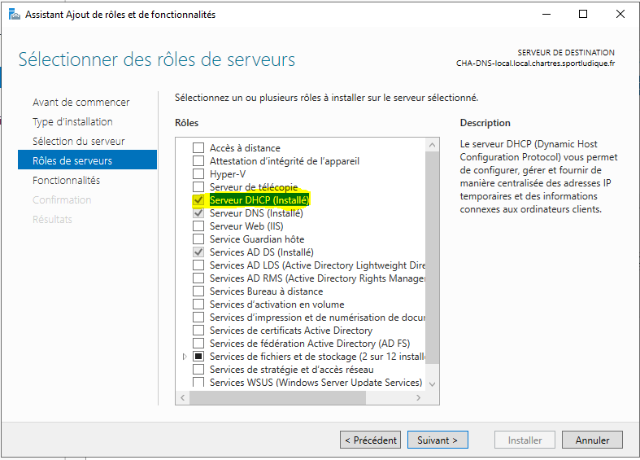
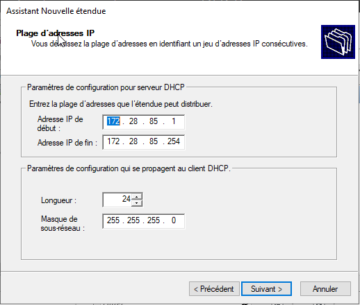
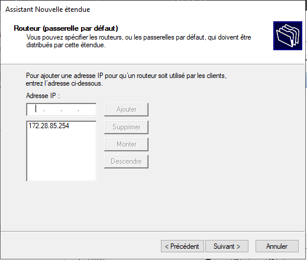
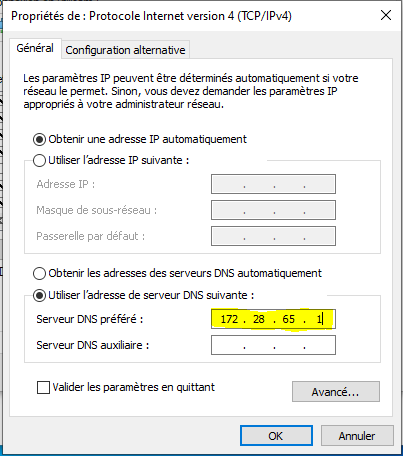

# Configuration DHCP

## Introduction
 
Après avoir installé le DNS, il faudra installer un service DHCP pour attribuer des adresses aux hôtes présents dans le réseau. Notamment ceux du VLAN 235 (Utilisateurs locaux du serveur privé) qui n'ont aucun serveur dans leur VLAN. Il faudra donc créer une plage s'adaptant au réseau que l'on a attribué à ce VLAN.
 

## Ajout du service et création de la plage
 

Pour commencer, j'ai ajouté le service DHCP à mon serveur.

 

 

Après avoir installé le rôle, je vais créer l'étendue dans les paramètres du serveur DHCP.

 

| @Plage de début | CIDR | @Plage de fin | @Passerelle | @DNS | Plage exclue |
|-----------------|------|---------------|-------------|------|--------------|
| 172.28.85.1     | /24  | 172.28.85.253 | 172.28.85.254 | 172.28.65.1 | 85.1 - 85.10

 

On a décidé d'exclure 10 adresses pour nous permettre d'accéder au réseau privé en cas de panne et ainsi être sûr d'avoir des adresses IP disponibles.

(L'erreur d'adresse IP de fin a été corrigée. Bien que cela ne nous aurait pas posé de soucis puisque nous n'avons pas beaucoup de machine et le DHCP va toujours commencer avec 172.28.85.1).

 
Preuve de la correction réalisée :

 

 

Étant donné que la plupart des menus sont identiques, je compte uniquement ajouter la fenêtre lors de la configuration de la passerelle.
En ce qui concerne la passerelle, j'utilise l'adresse IP de mon Switch.
 

Il suffira ensuite de continuer la configuration en respectant les paramètres ayant été mis en place auparavant, dans le tableau en haut de la page.

Désormais, il faut vérifier si le serveur a été configuré correctement. On va devoir réaliser un test sur une machine VirtualBox qui est connectée au VLAN 235 via nos switchs.

## Test du DHCP sur une machine cliente

Nous avons donc lancé une VM Windows 10 en s'assurant d'être en mode **Réseau privé hôte**. Une fois la VM lancée, j'ai ajouté le DNS aux paramètres réseau de ma.

 
J'ai ensuite raffraichi avec **`ipconfig/release`** et **`ipconfig/renew`**.

